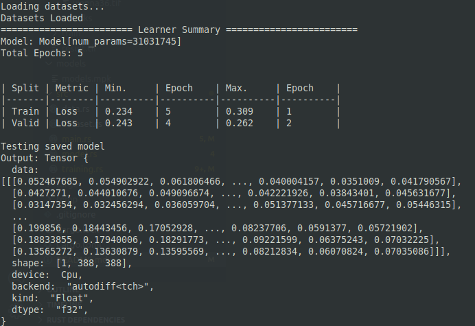
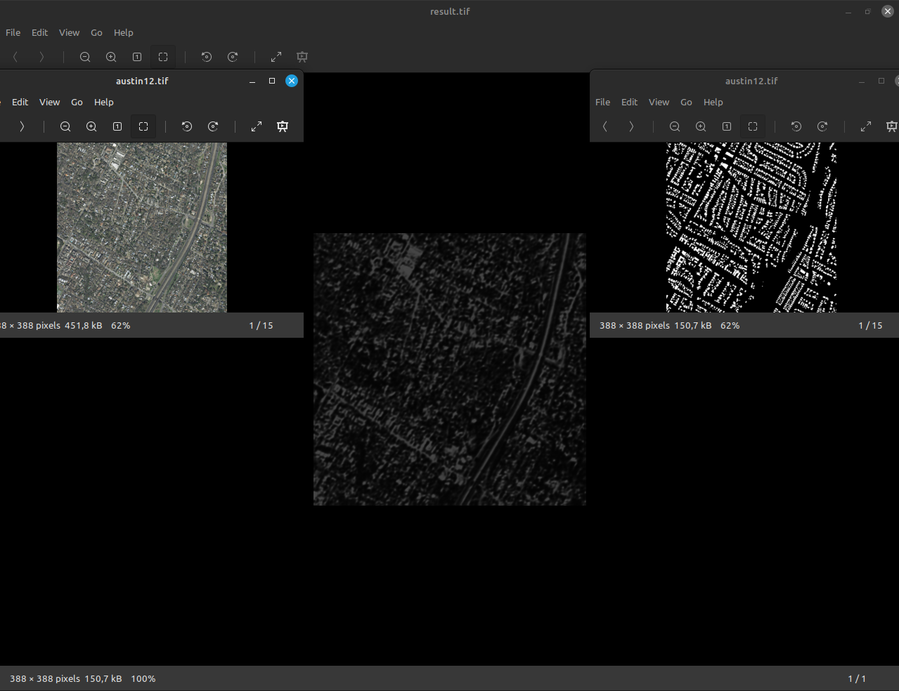

# unet-practice
U-net implementation for image segmentation in rust

# Тестування
В якості бекенду використовувалася бібліотека libtorch

Параметри навчання  
{  
      "model": {},  
      "optimizer": {  
        "weight_decay": null,  
        "momentum": null,  
        "gradient_clipping": null  
        },  
        "num_epochs": 5,  
        "batch_size": 1,  
        "num_workers": 4,  
        "seed": 42,  
        "learning_rate": 0.1,  
        "start_index": 0,  
        "margin": 150  
        }

## Результати навчання

